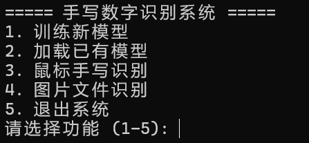
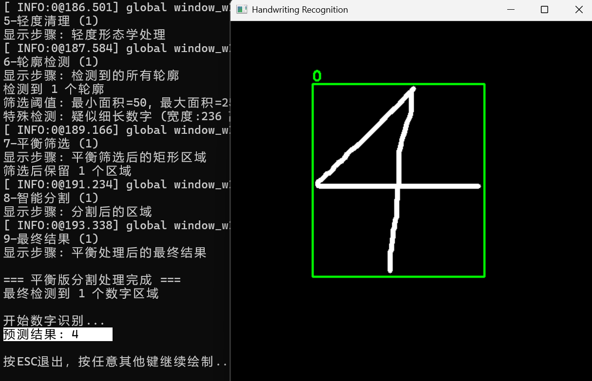
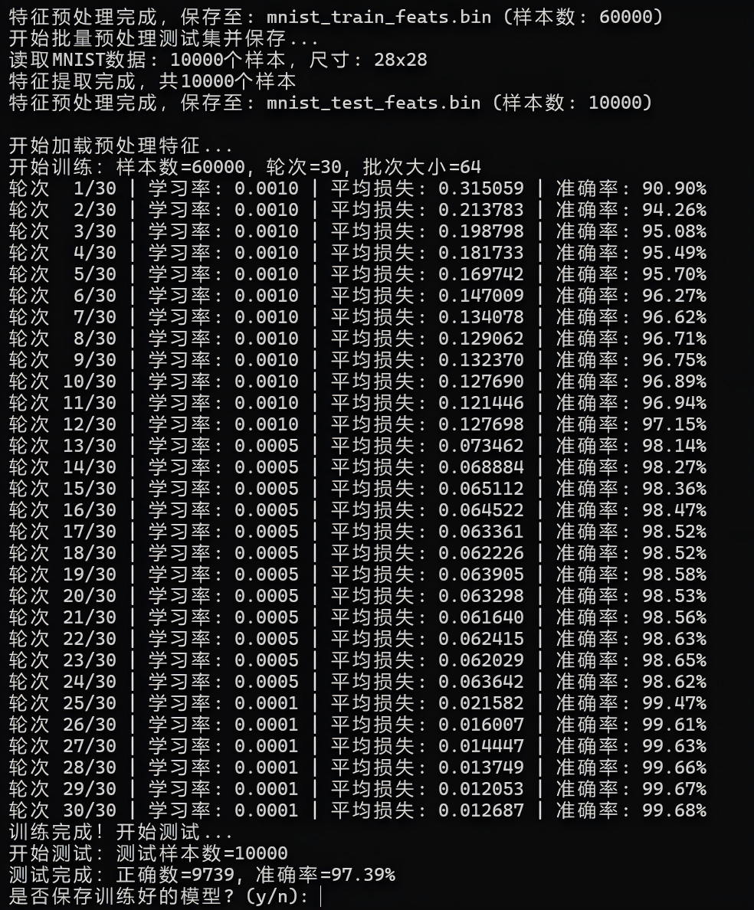
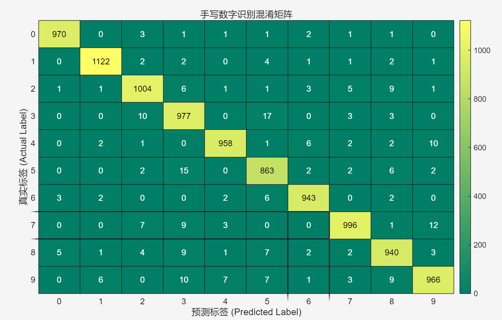
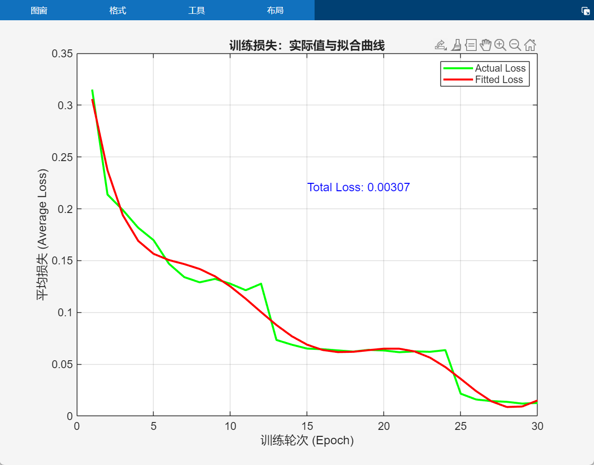
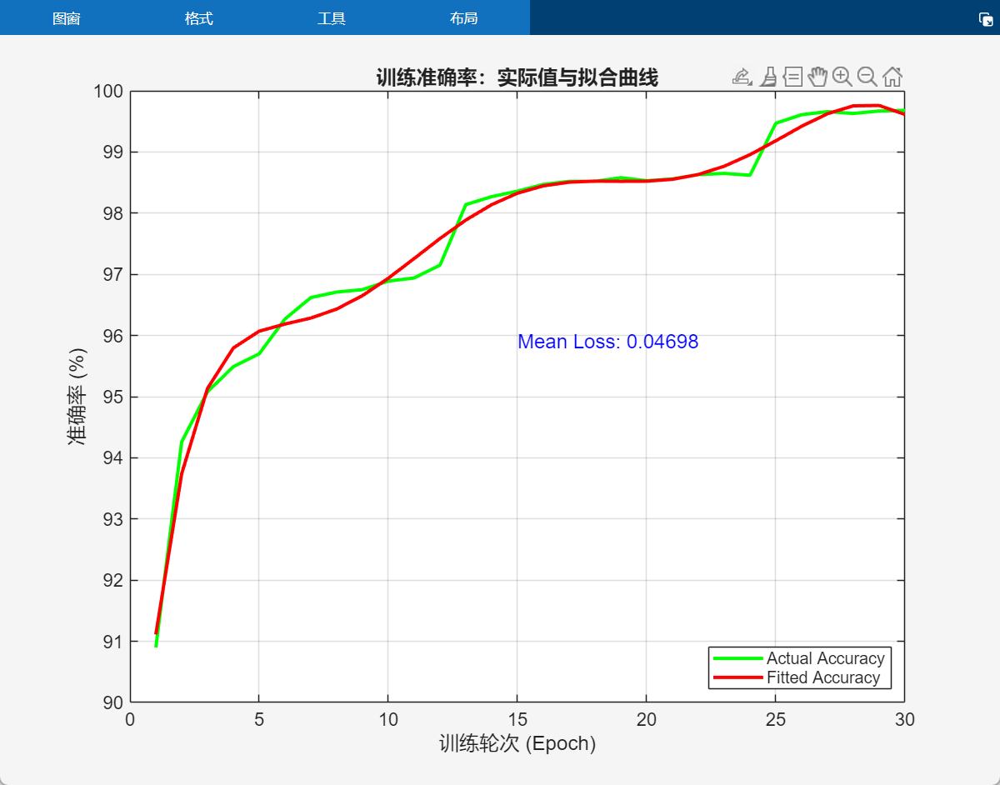
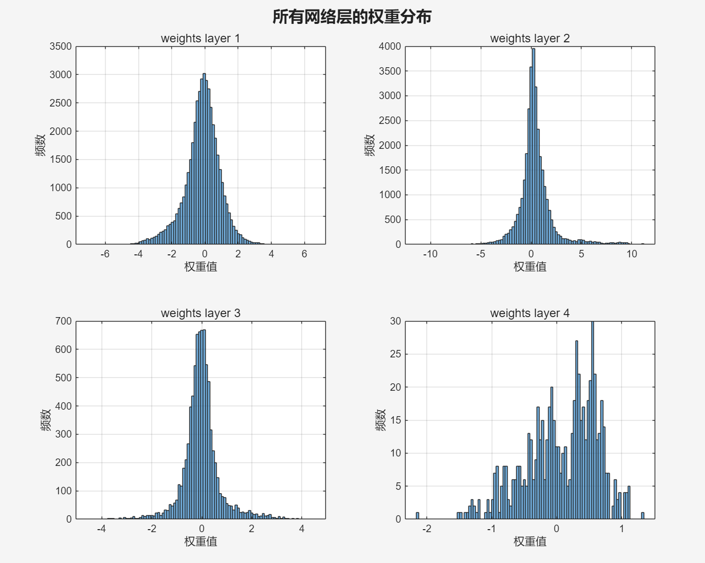

# Handwritten Digit Recognition using BP Neural Network (C++)

A complete handwritten digit recognition system implemented in pure C++ using a fully-connected Backpropagation Neural Network trained on the MNIST dataset.

The system supports:

- Real-time mouse handwriting recognition
- Automatic image digit detection and recognition
- Model training, saving, and loading
- OpenCV-based image preprocessing

**Final MNIST Test Accuracy: 97.39%**

---

# Demo

## System Menu



## Mouse Handwriting Recognition

Draw digits using mouse and recognize in real time.



## Image File Recognition

Detect and recognize multiple handwritten digits automatically.



---

# Model Performance

## Confusion Matrix



## Training Loss Curve



## Training Accuracy Curve



## Weights Distribution



---

# Features

- BP neural network implemented completely from scratch in C++
- MNIST dataset training support
- Real-time mouse handwriting recognition
- Automatic digit detection from images
- Model saving and loading
- OpenCV preprocessing pipeline
- Cross-platform support (Windows / Linux / macOS)

---

# Project Structure

```
My-MNIST-BP-Network/
│
├── src/                Source files (.cpp)
├── include/            Header files (.h)
├── data/               MNIST dataset (not included)
├── model/              Saved trained model
├── test_images/        Sample images
├── assets/             Demo and performance images
│
├── CMakeLists.txt
├── README.md
└── .gitignore
```

---

# Requirements

- C++17 or higher
- OpenCV 4.x
- CMake 3.12 or higher

Supported platforms:

- Windows
- Linux
- macOS

---

# Build Instructions

```
mkdir build
cd build
cmake ..
cmake --build . --config Release
```

Executable location:

```
build/Release/HandwritingRecognition.exe
```

---

# Run Instructions

Run:

```
HandwritingRecognition.exe
```

System menu:

```
1. Train new model
2. Load existing model
3. Mouse handwriting recognition
4. Image file recognition
5. Exit
```

---

# Neural Network Architecture

Fully-connected feedforward network:

Input layer:
```
784 neurons (28×28 pixels)
```

Hidden layers:
```
Fully connected layers
```

Output layer:
```
10 neurons (digits 0–9)
```

Activation function:
```
Sigmoid
```

Loss function:
```
Mean Squared Error (MSE)
```

Training method:
```
Mini-batch Gradient Descent + Backpropagation
```

---

# Dataset

MNIST dataset is NOT included due to size limitations.

Download:

https://yann.lecun.com/exdb/mnist/

Place files into:

```
data/
```

Required files:

```
train-images.idx3-ubyte
train-labels.idx1-ubyte
t10k-images.idx3-ubyte
t10k-labels.idx1-ubyte
```

---

# Model File

Saved model:

```
model/mnist_bp_model.bin
```

---

# Accuracy

Training samples:
```
60000
```

Test samples:
```
10000
```

Final accuracy:
```
97.39%
```

---
# Author

Guo-Yu-Tong  
GitHub: https://github.com/Guo-Yu-Tong


---

# License

This project is for:

- Educational use
- Research use


